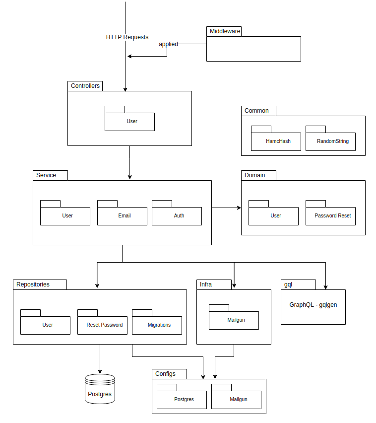
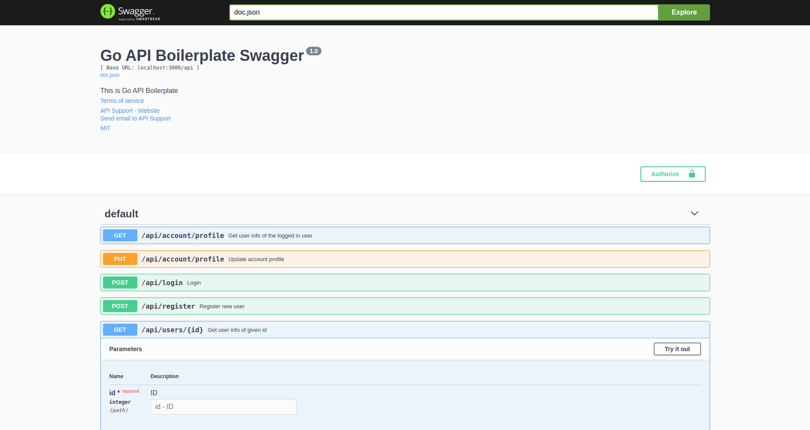
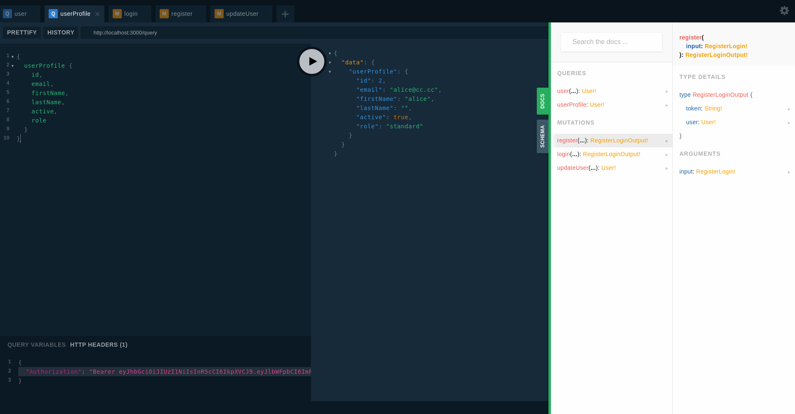

[](https://travis-ci.org/yhagio/go_api_boilerplate.svg?branch=master)
[](https://codecov.io/gh/yhagio/go_api_boilerplate)
[](https://opensource.org/licenses/mit-license.php)
[](https://github.com/ellerbrock/open-source-badges/)


# Go (Golang) REST / GraphQL API Boilerplate

- DEMO (GraphQL Playground): https://go-gin-postgres-api.herokuapp.com/graphql
- DEMO (REST API Swagger): https://go-gin-postgres-api.herokuapp.com/swagger/index.html

Note: in demo, I disabled email 

**Used libraries:**
- [gin](https://github.com/gin-gonic)
- [gin-swagger](https://github.com/swaggo/gin-swagger)
- [gorm](https://gorm.io/docs/)
- [jwt-go](https://pkg.go.dev/gopkg.in/dgrijalva/jwt-go.v3?tab=doc)
- [godotenv](https://pkg.go.dev/github.com/joho/godotenv?tab=doc)
- [gqlgen](https://github.com/99designs/gqlgen)
- [testify](https://github.com/stretchr/testify)
- [go-sqlmock](https://github.com/DATA-DOG/go-sqlmock)

---

- Components Diagram



- See Swagger Doc `http://localhost:3000/swagger/index.html`



- See GraphQL Playground `http://localhost:3000/graphql`



---

### Features

- [x] User Auth functionality (Signup, Login, Forgot Password, Reset Password)
- [x] JWT Authentication
- [x] REST API
- [x] GraphQL API
- [x] Gorm (Golang SQL DB ORM) with Postgres implementation and auto migration
- [x] Configs via environmental variables
- [x] Email notification (Welcome email, Reset password email)
- [x] Swagger REST API documentation
- [x] GraphQL playground
- [x] Unit tests
- [x] Dependency injection

---

### Run locally

Create `.env` at root, i.e.
```sh
MAILGUN_API_KEY=key-b9jksfh8s9843uhfsdhds
MAILGUN_DOMAIN=xxxxx.mailgun.org

EMAIL_FROM=support@go_api_boilerplate.com

DB_HOST=localhost
DB_PORT=5432
DB_USER=your-user
DB_PASSWORD=your-password
DB_NAME=local-dev-db

JWT_SIGN_KEY=secret
HAMC_KEY=secret
PEPPER=secret

ENV=development

APP_PORT=3000
APP_HOST=http://localhost
```

Run
```sh
# Terminal 1
docker-compose up        # docker-compose up (Run postgres)
docker-compose down      # docker-compose down (Shutdown postgres)

# Terminal 2
go run github.com/99designs/gqlgen -v # Generate Graphql stuff
swag init -g app/app.go               # Generates Swagger
go run *.go                           # Run application
go test -v -cover ./...               # Run go test
```

---

### Todo

- [ ] Input Validations
- [ ] Custom Error messages
- [ ] Logger
- [ ] More unit tests

maybe?

- [ ] gRPC
- [ ] Redis Streams
- [ ] Redis PubSub
- [ ] WebSocket
- [ ] MongoDB

---

### Contribution

Welcome for suggestions
